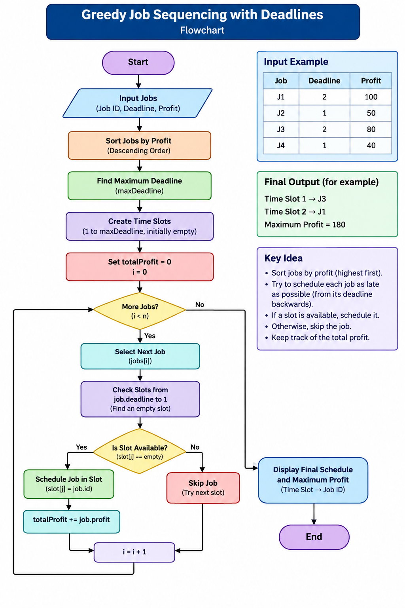

## Description

The Greedy Job Sequencing with Deadlines problem is a scheduling problem in which each job has a deadline and a profit. The objective is to select and schedule jobs so that the total profit is maximized while completing each selected job before its deadline.

The algorithm follows a greedy approach. Jobs are first arranged in descending order of profit. Each job is then assigned to the latest available time slot before or on its deadline. If no suitable slot is available, the job is skipped.

This project demonstrates the Greedy Job Sequencing with Deadlines algorithm using a C program and an AI-generated flowchart visualization.

## Pseudocode

BEGIN

Input all jobs

Find the maximum deadline

Sort all jobs in descending order of profit

Create empty time slots from 1 to maximum deadline

totalProfit = 0

FOR each job in sorted order

    FOR slot = job.deadline DOWNTO 1

        IF slot is empty THEN

            Schedule the job in that slot

            totalProfit = totalProfit + job.profit

            BREAK

        END IF

    END FOR

END FOR

Display scheduled jobs

Display totalProfit

END

## Complexity Analysis

### Time Complexity

* Sorting the jobs using Bubble Sort takes **O(n²)** time.
* Scheduling the jobs takes **O(n²)** time in the worst case because each job may check multiple time slots.
* Therefore, the overall time complexity of this implementation is **O(n²)**.

### Space Complexity

* The time-slot array requires **O(n)** space.
* Therefore, the overall space complexity is **O(n)**.

### Complexity Summary

| Operation               | Complexity |
| ----------------------- | ---------- |
| Sorting jobs            | O(n²)      |
| Job scheduling          | O(n²)      |
| Overall Time Complexity | O(n²)      |
| Space Complexity        | O(n)       |

## Prompt Used

Create a professional academic flowchart for the Greedy Job Sequencing with Deadlines algorithm.

The flowchart should show the following steps:

1. Start
2. Input jobs with Job ID, Deadline, and Profit
3. Sort jobs in descending order of profit
4. Find the maximum deadline
5. Create empty time slots
6. Select the next highest-profit job
7. Check for an available slot from the job's deadline backward to slot 1
8. If a slot is available, schedule the job and add its profit to the total profit
9. If no slot is available, skip the job
10. Check whether more jobs remain
11. Display the final job schedule
12. Display the maximum total profit
13. End

Use standard flowchart symbols:

* Oval for Start/End
* Rectangle for processing steps
* Diamond for decisions
* Arrows for control flow

Use a clean, professional academic style suitable for a college DAA project. Clearly label YES and NO branches.

## Output

### Program Output

The C program was compiled and executed successfully.

Greedy Job Sequencing with Deadlines
------------------------------------

Jobs:
Job     Deadline        Profit
A       2               100
B       1               50
C       2               80
D       1               40

Final Job Schedule:
Time Slot 1 -> Job C
Time Slot 2 -> Job A

Maximum Profit = 180

### AI-Generated Visualization

## Learning Outcome

* Understood the Greedy Job Sequencing with Deadlines algorithm.
* Learned how jobs are selected based on profit and deadlines.
* Understood how a greedy approach maximizes total profit.
* Learned how to represent an algorithm using a flowchart.
* Practiced using AI tools to generate algorithm visualizations.
* Practiced documenting a DAA project using GitHub.
