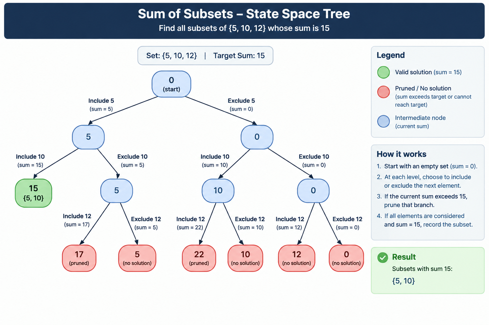

# Sum of Subsets using Backtracking

## Description

The **Sum of Subsets** problem asks: given a set of positive integers and a target value, find all subsets whose elements add up to exactly the target.

In this project:
- **Set** = {5, 10, 12}
- **Target Sum** = 15

At each step the algorithm makes a binary choice for every element — **include** it in the current subset or **exclude** it — and explores each possibility recursively. This produces a binary **state-space tree** where every leaf either reaches the target (solution), exceeds it (pruned), or exhausts all elements.

**Solution found:** {5, 10}  (5 + 10 = 15)

---

## Algorithm

1. Start with an empty subset and sum = 0.
2. For each element at the current index, make two recursive calls:
   - **Include** the element → add it to the subset and add its value to the current sum.
   - **Exclude** the element → move to the next index without changing the subset.
3. **Pruning rule:** if the current sum exceeds the target, stop exploring that branch immediately.
4. **Solution condition:** if the current sum equals the target, record the subset as a solution.
5. After each inclusion, **backtrack** by removing the element and trying the exclusion branch.

---

## Pseudocode

```
FUNCTION SumOfSubsets(arr, index, currentSubset, currentSum, target):

    IF currentSum == target THEN
        PRINT currentSubset          // Solution found
        RETURN

    IF index >= length(arr) OR currentSum > target THEN
        RETURN                       // Prune this branch

    // --- Include arr[index] ---
    currentSubset.ADD(arr[index])
    SumOfSubsets(arr, index+1, currentSubset, currentSum + arr[index], target)
    currentSubset.REMOVE(arr[index])   // Backtrack

    // --- Exclude arr[index] ---
    SumOfSubsets(arr, index+1, currentSubset, currentSum, target)

END FUNCTION

MAIN:
    arr    = {5, 10, 12}
    target = 15
    SumOfSubsets(arr, 0, {}, 0, target)
```

---

## State Space Tree

The state-space tree below shows every decision the algorithm makes.

- Each **node** displays the current subset and the running sum at that point.
- **Blue** nodes are valid, still-exploring states.
- **Green** node is the solution state where sum = 15.
- **Red** nodes are pruned because the sum exceeded 15.
- Edge labels show which element was included or excluded at that step.

```
                       Subset:{}, Sum:0
                       /               \
            Include 5                    Exclude 5
                /                               \
      Subset:{5}, Sum:5               Subset:{}, Sum:0
         /           \                   /           \
    Inc 10          Exc 10           Inc 10          Exc 10
       /                \               /                \
Subset:{5,10}    Subset:{5},Sum:5  Subset:{10},Sum:10  Subset:{},Sum:0
  Sum:15 ✓        Inc 12               Inc 12              Inc 12
 SOLUTION        Subset:{5,12}     Subset:{10,12}       Subset:{12}
                  Sum:17 ✗           Sum:22 ✗             Sum:12
                  PRUNED             PRUNED               (no sol.)
```

The full, accurately rendered tree is in **Visualization.png**.



---

## How Backtracking Works

1. **Decision point:** at each level of the tree, the algorithm decides whether to include or exclude the current element.
2. **Include branch:** add the element to the subset and recurse deeper with the updated sum.
3. **Prune:** if the sum exceeds 15 at any point, that entire branch is abandoned — no further recursion.
4. **Backtrack:** after exploring the include branch, the element is *removed* from the subset (undone), and the exclude branch is tried next.
5. **Solution:** when the running sum reaches exactly 15, the current subset is recorded as a valid answer.

This approach guarantees that every possible subset is considered without explicitly generating all 2ⁿ subsets upfront, and pruning cuts off unproductive branches early.

---

## Prompt Used

> "Create a clean academic state-space tree for the Sum of Subsets problem using backtracking. Use the set {5, 10, 12} and target sum 15. Show the root state and every include/exclude decision for each element. Label every node with the current subset and current sum. Clearly mark states exceeding the target as pruned, show backtracking decisions, and highlight the solution subset {5, 10} in green. Use a professional top-to-bottom textbook-style layout with readable rectangular nodes, clear arrows, minimal overlap, and a small legend. Title the diagram 'Sum of Subsets – State Space Tree' and subtitle it 'Backtracking | Set = {5, 10, 12} | Target = 15'. Make the final visualization high-resolution and suitable for a college DAA presentation."

---

## Output / Visualization

Running `Project11_SumOfSubsets.py` produces the following console output:

```
========================================
Sum of Subsets using Backtracking
Set = {5, 10, 12}
Target Sum = 15
========================================

Solutions Found: 1

Solution 1:
{5, 10}

Visualization Generated: Yes
Project Status: Complete
```

The state-space tree is saved as **Visualization.png** — a high-resolution academic diagram suitable for use in college presentations.


**Color coding in the visualization:**
| Color  | Meaning                    |
|--------|----------------------------|
| Blue   | Explored / valid state     |
| Green  | Solution state ({5, 10})   |
| Red    | Pruned (sum exceeds 15)    |

---

## Learning Outcome

After completing this project, students will be able to:

1. **Understand the Sum of Subsets problem** — how it is a classic combinatorial search problem solvable with backtracking.
2. **Trace the state-space tree** — understand how include/exclude decisions at each level build a binary tree of states.
3. **Apply pruning** — recognize that branches whose running sum exceeds the target need not be explored, saving significant computation.
4. **Understand backtracking** — see how undoing the last choice (removing an element from the subset) allows the algorithm to explore alternate paths without re-running from scratch.
5. **Analyze complexity** — without pruning the worst case is O(2ⁿ); pruning can dramatically reduce the actual nodes visited in practice.
6. **Connect theory to visualization** — map the abstract recursive algorithm directly onto a concrete state-space tree diagram.
