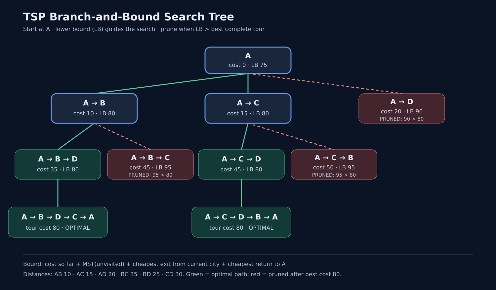

# TSP Branch-and-Bound Search Tree (4 Cities)

## What this shows

The **Traveling Salesperson Problem (TSP)** asks for the cheapest tour that visits every city once and returns to the start. This example starts at **A** and uses branch and bound: each branch chooses the next city, while a **lower bound (LB)** estimates the cheapest possible completed tour from that partial route. A branch is pruned once its LB is greater than the best complete tour found so far.

[Open the animated walkthrough](Animation.html) to play, pause, or step through the decisions. [View the PNG image](Visualization.png) or [the SVG version](Visualization.svg) for a static diagram suitable for a report.



## Distances

Travel costs are symmetric. Each number is the cost of traveling directly between two cities.

| From / to | A | B | C | D |
|:--|--:|--:|--:|--:|
| **A** | — | 10 | 15 | 20 |
| **B** | 10 | — | 35 | 25 |
| **C** | 15 | 35 | — | 30 |
| **D** | 20 | 25 | 30 | — |

## How the lower bound works

For a partial path ending at `current`, let `U` be its unvisited cities. The animation calculates:

```text
LB = cost so far
   + minimum spanning tree cost over U
   + cheapest edge from current into U
   + cheapest edge from U back to A
```

The minimum spanning tree (MST) connects all unvisited cities at the lowest possible cost without requiring a tour. The two extra edges account for leaving the current city and eventually returning to A. Because any completed tour must make these connections, this total cannot exceed the cost of the cheapest completion. If `U` has one city, its MST cost is zero. If `U` is empty, the exact tour cost is `cost so far + cost(current, A)`.

For the root `A`, the MST over `{B, C, D}` uses `B–D = 25` and `D–C = 30`, for a total of 55. The cheapest departure from A and return to A each cost 10, so **LB(A) = 0 + 55 + 10 + 10 = 75**.

For `A → B`, the path costs 10. The MST over `{C, D}` costs 30, the cheapest edge from B into that set costs 25, and the cheapest return to A costs 15. Thus **LB(A → B) = 10 + 30 + 25 + 15 = 80**.

For `A → D`, the bound is **20 + 35 + 25 + 10 = 90**. Once a tour of cost 80 has been found, this branch can be pruned without exploring either of its possible continuations.

## Search order and outcome

The animation uses depth-first search, trying children in increasing LB order. It first reaches `A → B → D → C → A`, which costs `10 + 25 + 30 + 15 = 80`. That becomes the **incumbent**, or best known complete tour.

| Partial path | Cost so far | LB | Decision after incumbent = 80 |
|:--|--:|--:|:--|
| A | 0 | 75 | Expand |
| A → B | 10 | 80 | Expand |
| A → B → D | 35 | 80 | Complete remaining tour |
| A → B → C | 45 | 95 | Prune |
| A → C | 15 | 80 | Expand |
| A → C → D | 45 | 80 | Complete remaining tour |
| A → C → B | 50 | 95 | Prune |
| A → D | 20 | 90 | Prune |

The second optimal tour is `A → C → D → B → A`, costing `15 + 30 + 25 + 10 = 80`. The rule here is **prune only when LB > incumbent**, so branches with LB equal to 80 remain available to reveal all optimal tours. The two complete tours shown are reverse directions around the same cycle; in this symmetric TSP they have equal cost. The other branches cannot improve on 80 because their valid lower bounds already exceed it.

## Algorithm outline

```text
best = infinity
search(path = [A]):
    bound = lower_bound(path)
    if bound > best:
        prune path
        return
    if all cities have been visited:
        tour_cost = path_cost + cost(last_city, A)
        update best and record the tour
        return
    make one child for each unvisited next city
    visit children in increasing lower-bound order
```

Branch and bound can still explore factorially many partial routes in the worst case; a useful bound reduces the work in examples where many branches are provably too expensive. For four cities, the diagram makes every bound and pruning decision visible.

## Run and reuse

Open `Animation.html` in a browser. It is self-contained and needs no server, packages, or internet connection. Use **Play**, **Pause**, **Back**, **Next**, **Reset**, and **Speed** to control the walkthrough. Use `Visualization.png` as a ready-to-share image, or `Visualization.svg` when a scalable diagram is needed.

## Prompt

> “Draw a search tree showing bounding and pruning for TSP with 4 cities.”

The visualization extends that prompt with an animated step-by-step trace and explicit numerical bounds.
